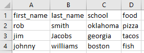

# column matching to merge datasets based on multiple columns and fuzzy matching

Required modules:

fuzzywuzzy (pip install fuzzywuzzy)

levenshten (pip install python-levenshtein)

Inputs:
1. 2 csvs to match
2. common words to remove for matching (common_words.json)

#### Common Words

3. columns to use from each csv for matching

An example function call:

new_df = fuzzy_merge(first_df, second_df, key1=['last_name', 'first_name', 'school'],
                     key2=['first_name', 'school', 'last_name'])

Where they keys are the matching columns. Order will not matter as it's done by text tokenization and a method called 'token_sort_ratio' which ignores order. You can also change the threshold of matching, it's current set at 80% matching by Levenshtein distance.

#### First Input

#### Second Input

The results are outputted to: output.csv

#### Output

